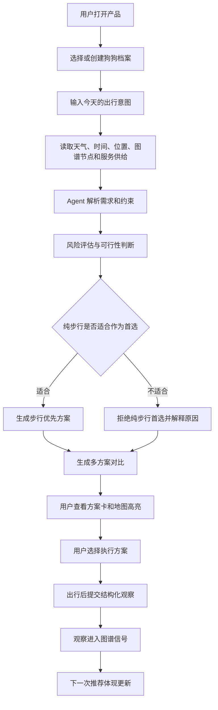
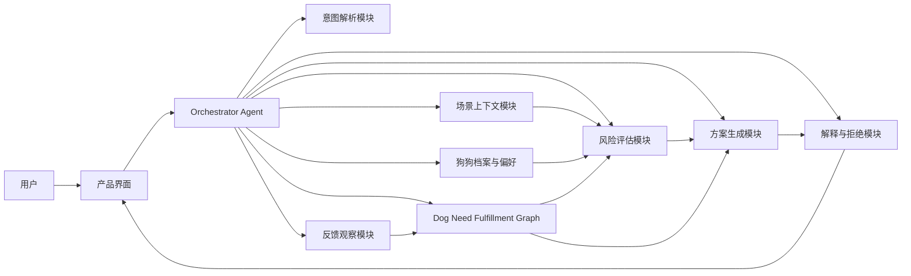
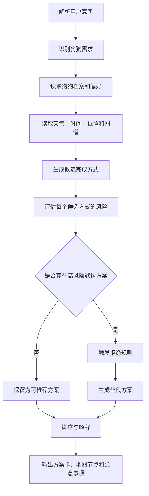
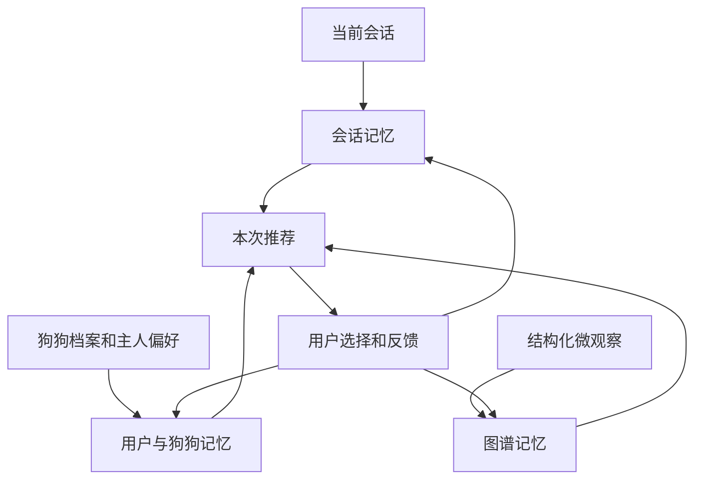

# PRD：Pet Mobility Agent / 带宠出行决策系统

状态：草案  
日期：2026-06-13  
阶段：黑客松 MVP，后续可扩展为城市带宠出行平台  
主要读者：产品、设计、工程、测试、路演团队、后续实现 Agent  

## 一、执行摘要

Pet Mobility Agent 是一个面向中国大陆城市养狗人的带宠出行决策系统。它不把“遛狗”默认理解为一条步行路线，而是根据狗狗档案、出行意图、天气、城市微环境、交通压力、宠物服务供给和历史观察，判断今天这只狗应该如何安全完成排便、嗅闻、放电、降压、社交或避社交。

这个产品的核心不是“附近有什么宠物友好地点”，而是“在今天这个时间、这个天气、这个片区、这只狗的状态下，哪些空间、路径、交通方式和服务组合可以完成它的需求”。因此，Pet Mobility Agent 更像一个带宠出行任务规划器，而不是一个宠物 POI 目录。

本次 MVP 的核心场景是：用户在步行环境不友好的中国城市片区提出“30-40 分钟遛狗”请求，系统识别高温、主干路、电动车、绿地不足、小区出入口限制等风险后，拒绝盲目生成纯步行路线，并给出三类可执行替代方案：

- 附近微出门：在小区内或楼下短时间完成排便、嗅闻、低强度放松。
- 多方式接驳出行：通过打车、自驾或短距离接驳前往更适合狗狗完成需求的空间。
- 服务或空间预约：预约室内宠物跑场、训练师、洗护、宠物友好空间或低刺激服务。

核心地图层是 Dog Need Fulfillment Graph / 狗狗需求完成图谱。它不是通用 POI 地图，也不是宠物友好地点列表，而是记录“哪些空间、时间、入口、边界、交通方式和服务能够帮助这只狗完成具体需求”的语义图谱。

一句话定位：

> 高德和百度解决人和车怎么走；Pet Mobility Agent 解决狗和主人今天能不能出门、怎么出门、在哪里完成需求。

## 二、背景

### 2.1 宠物市场背景

中国宠物市场正在从“养宠消费”进入“养宠生活方式基础设施”阶段。过去几年，宠物食品、医疗、洗护、美容、用品和保险等品类逐渐成熟，用户愿意为宠物健康、体验和便利性支付更多费用。对于城市养狗人来说，宠物已经不只是家庭里的消费对象，而是日常时间安排、居住选择、周末活动和城市出行决策的一部分。

当前市场上已经出现了几类相关供给：

- 宠物服务：洗护、美容、寄养、训练、上门喂养、上门遛狗。
- 宠物空间：宠物友好商场、宠物餐厅、室内跑场、私家草坪、宠物乐园、营地。
- 宠物内容社区：地点推荐、经验分享、犬种知识、训练内容。
- 宠物硬件：定位器、智能喂食器、饮水机、摄像头、活动记录设备。
- 本地生活入口：地图、点评、团购、打车、社区团购和服务预约。

但这些供给大多仍然围绕“单点服务”或“单点地点”展开。用户可以找到一家洗护店、一个宠物友好餐厅，或者一个私家草坪，但很难把这些资源和当天真实出行约束串成一个完整方案。

宠物市场的下一层机会，不是再做一个更全的宠物地点目录，而是把宠物需求、城市空间、交通方式、本地服务和 Agent 决策连接起来，让系统真正回答：

- 今天适不适合带狗出门？
- 这只狗适合走、坐车、去室内空间，还是只做楼下短出门？
- 哪些需求必须现在完成，哪些需求可以延期或替代？
- 哪个地点不是“宠物友好”而已，而是真能完成排便、放电、降压或避刺激？
- 宠物服务如何出现在用户有明确任务的时候，而不是只作为广告或搜索结果出现？

### 2.2 背景与问题

中国大陆大量城市片区并不天然适合步行遛狗。尤其在高密度社区、车行优先新区、主干路切割片区、夏季高温城市和小区封闭管理环境里，“从家门口开始走 30 分钟”并不总是安全或有效。

用户面对的真实问题通常不是“不知道附近哪里宠物友好”，而是：

- 不知道今天是否适合出门。
- 不知道这只狗应该短走、长走、打车、自驾、预约空间，还是只在小区内完成最低需求。
- 不知道哪段路有电动车、主干路、无遮阴、狗群、复杂过街、施工围挡或地表高温风险。
- 不知道如何把排便、嗅闻、放电、洗护、就医、取快递等任务合并成一次可执行出行。
- 不知道地图上的“近”是否等于真实可用，尤其是小区门、地库口、入口、电梯、上下车点、停车点这些最后 100 米信息。
- 不知道“宠物友好”是不是只允许进入，还是能真正停留、活动、排便、避热、避狗、喝水或获得服务。

现有方案的断点在于：

- 普通地图理解人和车的路线，但不理解狗狗需求。
- 宠物友好地图理解地点标签，但不理解当天是否适合到达和停留。
- 遛狗服务解决找人代遛，但不解决主人自己带狗出行的决策。
- 宠物 GPS 硬件记录位置和活动，但不判断城市空间是否可用。
- 私人狗狗空间解决预约场地，但没有把小区、天气、交通、狗狗档案和服务串成完整方案。

因此，Pet Mobility Agent 的机会是把“狗狗需求”作为规划中心，而不是把“路线最短”或“地点最近”作为规划中心。

## 三、目标用户与使用场景

### 3.1 主要用户

主要用户是居住在中国大陆城市中的养狗人，尤其是以下几类：

- 居住在低步行友好片区的用户，例如主干路密集、新区尺度过大、绿地入口少、小区封闭管理严格。
- 养高能量犬的用户，例如边牧、柴犬、拉布拉多、金毛、杜宾等，需要更稳定的放电方案。
- 养短鼻犬、老年犬、幼犬、术后犬或慢病犬的用户，需要保守的温度、强度和距离控制。
- 养反应犬或敏感犬的用户，需要避开狗群、电动车、人流、儿童、噪声和复杂路口。
- 新手养狗人，不确定什么样的出门计划才算安全、足够和可执行。

### 3.2 次要用户

次要用户包括宠物服务和城市空间供给方：

- 宠物洗护店、训练师、室内宠物空间、私人草坪、宠物营地。
- 宠物友好商圈、社区商业、社区物业。
- 宠物友好车服务、宠物医院、宠物用品零售。
- 需要理解产品差异化的黑客松评委、投资人或合作伙伴。

### 3.3 核心使用场景

本 PRD 优先覆盖三个高频场景：

- 工作日短时间出门：用户只有 10-40 分钟，需要解决排便、嗅闻、短暂活动。
- 高风险天气出门：高温、高湿、雨后、地表温度高，普通步行路线不适合作为首选。
- 低步行友好片区出门：附近路网、交通和空间条件不适合狗持续步行，需要接驳或预约替代方案。

## 四、技术范围与优先级

本节从工程实现角度定义 MVP 到平台化的范围。优先级不是商业路线图，而是技术能力的分层：先做可演示、可验证的闭环，再扩展真实数据、持久化和外部服务。

### 4.1 P0：黑客松 MVP 必须完成

P0 的目标是完成一个端到端可演示的出行决策闭环。可以使用样例片区、模拟数据和本地状态，但 Agent 的判断逻辑、方案结构和地图节点关系必须清晰。

必需能力：

- 狗狗档案输入：名字、品种或体型特征、年龄、精力等级、怕热程度、反应性等级、特殊备注。
- 出行意图输入：时间预算、主要需求、次要需求、避免偏好、交通偏好。
- 场景上下文读取：当前时间、天气、湿度、温度、样例片区、用户当前位置。
- Dog Need Fulfillment Graph 样例数据：小区门、地库口、阴影路、草地、冲突路口、上车点、室内宠物空间、洗护点、训练点。
- 风险判断能力：热风险、地表风险、交通刺激、狗群刺激、步行适配度、时间可行性。
- 不安全路线拒绝：在高风险场景下明确拒绝纯步行作为首选方案，并给出原因。
- 三类方案生成：附近微出门、多方式接驳出行、服务或空间预约。
- 方案对比卡：展示需求完成度、安全风险、热/地表风险、交通刺激、时间匹配、成本、预约需求。
- 地图节点联动：用户选择方案时，高亮对应节点、风险点和服务点。
- 结构化微观察原型：允许用户提交“这里有阴影”“狗很多”“电动车压力大”“草地不可用”等观察，并在当前会话中影响后续推荐。

### 4.2 P1：第一版产品化能力

P1 的目标是让 MVP 从演示系统变成可被真实用户反复使用的早期产品。重点是持久化、真实服务接入和更细分的狗狗模式。

建议能力：

- 账号与常用狗狗档案：支持多只狗、多家庭成员、常用偏好。
- 常用地点与常用路线：家、小区门、常去草地、常用上车点、常去宠物空间。
- 反应犬模式：低刺激路线、撤离点、狗群密度、可视距离、时间段建议。
- 短鼻犬和老年犬模式：更保守的温度阈值、运动强度和出行时长。
- 服务行动入口：室内跑场、训练师、洗护、宠物友好车、宠物医院。
- 真实天气和地图服务接入：读取实时天气、路网、POI、行程时间。
- 用户反馈持久化：把结构化观察沉淀到图谱信号中，支持审核和可信度。
- 方案收藏：常用排便方案、工作日短出门方案、周末放电方案。

### 4.3 P2：平台化与生态能力

P2 的目标是扩展到多城市、多服务方和更复杂的城市带宠生态。

长期能力：

- 多城市 Dog Need Fulfillment Graph。
- 商家后台：服务可用性、可预约时间、宠物限制、空间容量。
- 物业和商圈后台：入口规则、禁入区域、带宠动线、冲突点分析。
- 真实预约、支付、订单、评价和售后。
- 宠物硬件数据接入：活动量、定位、健康趋势、异常提醒。
- 可信社区贡献体系：观察审核、贡献者信誉、异常数据回滚。
- 多 Agent 协作架构：在数据量、服务种类和决策复杂度上升后，引入更明确的专业 Agent 分工。

### 4.4 暂不进入范围

以下内容不进入本次 MVP：

- 全国真实地图数据采集。
- 真实支付、订单和履约。
- 商家后台与运营后台。
- 医疗诊断和医疗建议。
- 宠物行为训练的专业诊断。
- 硬件设备绑定。
- 社交社区和内容流。
- 完整的用户增长、会员、积分和营销体系。

## 五、核心用户流程

核心用户流程是本产品最重要的部分。Pet Mobility Agent 的价值不在于展示一个地点，而在于把“狗狗今天要完成什么需求”翻译成可执行的出行任务，并在风险高时给出负责任的替代方案。

### 5.1 流程总览

用户不应该被迫先搜索地点或路线。理想流程从“今天这只狗需要什么”开始，再由 Agent 根据上下文判断出门策略。

### 5.2 第一步：狗狗档案

狗狗档案不是普通资料页，而是 Agent 判断风险和需求优先级的基础。用户首次使用时，需要以低负担方式输入最小必要信息。MVP 可以用表单完成，后续可以支持自然语言补充。

档案应覆盖：

- 基本识别：名字、品种或体型、年龄段。
- 运动特征：精力水平、日常运动量、是否容易过度兴奋。
- 温度敏感：怕热程度、是否短鼻犬、是否老年犬、是否有心肺问题。
- 反应性：是否怕狗、怕人、怕车、怕电动车、怕儿童、怕噪声。
- 出行习惯：是否能坐车、是否能进笼、是否能去室内空间。
- 主人偏好：是否愿意打车、自驾、预约服务、避开主干路、避开狗群。

档案的产品原则是“足够判断，不追求一次填完”。如果用户只填写犬种、年龄、精力和怕热程度，Agent 就应该能先给出保守方案；如果用户继续补充反应性、常去地点和历史反馈，系统再逐步变聪明。

### 5.3 第二步：出行意图输入

用户的输入可以是自然语言，也可以是结构化选择。MVP 建议同时支持“自然语言一句话”和“关键选项”，以便演示 Agent 理解能力，同时保证判断稳定。

典型输入包括：

- 时间预算：10 分钟、20 分钟、40 分钟、半天。
- 主要需求：排便、嗅闻、放电、降压、社交、避社交、洗护、就医。
- 优先级：必须现在完成、可以部分完成、可以替代完成。
- 避免偏好：不想过大马路、不想遇到狗、不想晒太阳、不想打车、不想去商场。
- 可接受方式：步行、打车、自驾、室内空间、预约服务、小区内短出门。

Agent 需要把一句“我只有 40 分钟，狗很兴奋，最好不要过大马路”解析为几个决策变量：

- 时间紧张。
- 狗狗有放电需求。
- 用户有交通风险规避偏好。
- 不能只按距离最近生成路线。
- 如果步行环境差，需要考虑接驳或空间预约。

### 5.4 第三步：上下文收集

在用户提交意图后，系统需要收集当前场景上下文。MVP 可以使用样例数据，但产品结构上要为真实接入留出位置。

上下文分为五类：

- 天气上下文：气温、湿度、降雨、体感温度、时间段、日照强度。
- 城市空间上下文：小区门、出入口、绿地、阴影、路口、围挡、可停留区域。
- 交通上下文：主干路、电动车压力、过街复杂度、上车点、停车点、车程时间。
- 服务上下文：室内跑场、洗护店、训练师、宠物友好空间、可预约时间。
- 历史上下文：狗狗过往偏好、用户常选方案、结构化观察、被拒绝或不可进入记录。

这些上下文进入 Agent 后，不应该只是作为展示信息，而要参与风险判断和方案排序。

### 5.5 第四步：风险判断

风险判断是产品的关键分水岭。普通地图默认“给路线”，Pet Mobility Agent 必须先判断“是否应该给这条路线”。在高风险场景下，拒绝不安全方案本身就是产品价值。

风险判断至少包含六个维度：

- 热/地表风险：气温、湿度、日照、地面材质、阴影比例、狗狗怕热程度。
- 交通刺激：主干路、电动车混行、过街次数、路口复杂度、上下车安全性。
- 狗群和人流刺激：高峰时段、常见狗群、儿童密度、商圈人流。
- 步行适配度：连续可走空间、绿地可达性、停留点密度、可撤离点。
- 需求完成度：排便、嗅闻、放电、降压、社交或避社交能否完成。
- 主人可执行性：时间预算、成本接受度、交通方式、预约意愿。

判断结果不应只输出一个分数，而要输出“是否适合作为首选”和“为什么”。例如：

- 纯步行不适合作为首选，因为当前温度高、阴影不足、主干路过街复杂，并且狗狗怕热程度高。
- 楼下微出门适合完成排便和低强度嗅闻，但不能充分放电。
- 打车到室内跑场更适合完成放电，但成本更高，需要预约。

### 5.6 第五步：拒绝不安全纯步行

当风险超过阈值时，Agent 必须明确拒绝纯步行作为首选，而不是把风险藏在提示里。拒绝语气要坚定、解释要具体、替代方案要立刻跟上。

拒绝不是“无法服务”，而是“换一种更合适的完成方式”。用户看到的体验应该是：

- 先说明不推荐什么。
- 再说明为什么。
- 再给出可执行替代方案。
- 再告诉用户如果仍坚持步行，需要如何降低风险。

例如，在 34°C、湿度 72%、下午、边牧、40 分钟、避免大马路的场景中，系统应该表达：

- 不建议把 30-40 分钟纯步行作为首选。
- 主要原因是热/地表风险高、交通刺激高、连续阴影和安全停留点不足。
- 推荐先完成 8 分钟楼下排便和阴影嗅闻，再通过接驳去室内宠物空间放电。
- 如果用户只想在附近完成，则应降低目标，从“放电”改为“排便 + 降压 + 短嗅闻”。

### 5.7 第六步：生成三类方案

Agent 至少生成三类方案，避免把用户锁死在单一路线里。每类方案都应有明确适用场景。

第一类：附近微出门。

适用于高温、时间很短、狗狗状态不稳定、主人不想移动太远的情况。它的目标不是充分放电，而是完成最低必要需求，例如排便、短嗅闻、情绪降压。

应包含：

- 从哪个小区门或楼下点位出发。
- 停留在哪些阴影、草地或低刺激节点。
- 总时长和最大连续暴露时间。
- 哪些需求可以完成，哪些需求不能完成。
- 如果遇到狗群、电动车或地面过热，如何撤回。

第二类：多方式接驳出行。

适用于附近不好走，但城市内存在更适合狗狗需求的空间。它的目标是通过打车、自驾或短距离接驳，把“危险或低效的步行段”替换成“更安全的到达方式”。

应包含：

- 安全上车点。
- 接驳方式和预计时长。
- 目的地节点。
- 到达后的活动安排。
- 返程方式和备选撤离点。
- 成本和是否需要准备牵引、胸背、饮水、尿垫或车内保护用品。

第三类：服务或空间预约。

适用于狗狗需要放电、训练、洗护、避热、避社交或专业协助的情况。它的目标是把出行任务转化为服务任务。

应包含：

- 推荐服务类型。
- 为什么这个服务匹配当前需求。
- 预约时间窗口。
- 是否适合反应犬、短鼻犬、老年犬或高能量犬。
- 到达和离开时的低刺激动线。
- 如果服务不可用，应该回退到哪一个方案。

### 5.8 第七步：方案对比与地图联动

方案不应只是一段文本，而应以统一结构呈现，方便用户比较和执行。

每个方案都应展示：

- 方案标题。
- 适合原因。
- 主要步骤。
- 预计总时长。
- 估算成本。
- 是否需要预约。
- 可完成的狗狗需求。
- 未能完成或只能部分完成的需求。
- 主要风险和规避方式。
- 地图节点：出发点、停留点、风险点、上车点、服务点、撤离点。

地图联动的重点不是画一条漂亮路线，而是让用户理解“为什么这些节点重要”。例如，同样是 300 米，小区侧门到阴影草地可能比主门到开阔广场更适合；同样是打车，地库口可能比主干路边更适合作为上车点。

### 5.9 第八步：执行中辅助

MVP 可以不做实时导航，但 PRD 需要定义未来执行中的辅助能力。

执行中辅助包括：

- 出发前检查：水、牵引、胸背、拾便袋、降温用品、预约确认。
- 风险提醒：连续暴露时间过长、即将经过主干路、附近狗群密度高。
- 需求确认：是否已经排便、是否已经放松、是否仍然兴奋。
- 方案切换：如果草地不可用、狗群过多、温度升高或服务取消，切换到备选方案。
- 快速撤回：提示最近的安全撤离点、小区门、上车点或室内空间。

### 5.10 第九步：出行后反馈

出行后反馈是图谱进化的来源。反馈不能只是星级评分，而应尽量结构化，让系统知道哪个节点、哪个时间段、哪类狗狗、哪类需求发生了什么。

反馈应覆盖：

- 需求是否完成：排便、嗅闻、放电、降压、社交、避社交。
- 节点是否可用：草地是否开放、入口是否可进、店铺是否接待宠物。
- 风险是否出现：狗很多、电动车多、地面烫、无遮阴、噪声大。
- 方案是否可执行：时间是否准确、成本是否可接受、上车点是否安全。
- 狗狗状态变化：更平静、更兴奋、紧张、疲劳、过热、拒绝前进。

这些反馈进入 Dog Need Fulfillment Graph 后，可以影响下一次推荐。例如，如果多个用户在下午反馈某草地狗群密度高，反应犬模式就应降低该节点权重；如果某地库口被验证为安全上车点，接驳方案就可以优先使用它。

### 5.11 黑客松固定演示流程

为了让路演稳定，MVP 应准备一个固定演示场景。

输入：

- 城市片区：重庆某新区样例区。
- 天气：34°C，湿度 72%，下午。
- 狗狗：边牧，3 岁，精力 5/5，怕热 4/5，反应性 3/5。
- 用户意图：40 分钟内完成排便和放电，最好不要穿过大马路。

预期过程：

1. 用户选择边牧档案。
2. 用户输入“我只有 40 分钟，想让它排便和放电，最好不要过大马路”。
3. Agent 读取天气、狗狗档案、片区图谱、服务节点。
4. Agent 判断纯步行不适合作为首选。
5. 系统展示拒绝理由：热/地表风险高、交通刺激高、连续可用空间不足。
6. 系统生成三类方案。
7. 用户点击“接驳到室内宠物跑场”。
8. 地图高亮小区地库上车点、目的地、服务点和撤离点。
9. 用户模拟提交观察：“楼下草地今天狗很多，下午不适合反应犬”。
10. 系统展示下一次推荐中该草地的刺激风险上升。

演示要让观众清楚看到产品差异：

- 它不是搜索“附近宠物友好”。
- 它不是生成一条最短步行路线。
- 它会拒绝不安全的默认方案。
- 它会把狗狗需求、城市风险和服务供给组合成一个任务计划。

## 六、功能需求

本节主要列出功能需求。需求编号用于后续拆任务和验收。

### 6.1 狗狗档案与出行意图

- REQ-001：系统必须支持创建或编辑一个狗狗档案。
- REQ-002：狗狗档案必须包含名字、品种或体型、年龄、精力等级、怕热等级、反应性等级。
- REQ-003：系统必须支持输入或选择出行需求，包括排便、嗅闻、放电、降压、社交、避社交、洗护、就医。
- REQ-004：系统必须支持输入时间预算。
- REQ-005：系统必须支持输入避免偏好，例如避免大马路、避免狗群、避免高温硬质路面。
- REQ-006：系统必须允许用户补充交通偏好，例如只步行、可打车、可自驾、可预约。

优先级：P0。

### 6.2 风险判断与拒绝机制

- REQ-007：系统必须评估热/地表风险。
- REQ-008：系统必须评估交通刺激风险。
- REQ-009：系统必须评估步行适配度。
- REQ-010：系统必须评估需求完成度，而不是只评估路线可达性。
- REQ-011：当风险超过阈值时，系统必须拒绝纯步行作为首选方案。
- REQ-012：拒绝时必须说明至少两个主要原因。
- REQ-013：拒绝后必须给出替代方案，而不是只展示警告。

优先级：P0。

### 6.3 方案生成

- REQ-014：系统必须生成附近微出门方案。
- REQ-015：系统必须生成多方式接驳出行方案。
- REQ-016：系统必须生成服务或空间预约方案。
- REQ-017：每个方案必须包含标题、适合原因、步骤、总耗时、估算花费、预约需求和主要风险。
- REQ-018：每个方案必须说明哪些狗狗需求可以完成，哪些只能部分完成或不能完成。
- REQ-019：系统必须给方案排序，并说明推荐理由。

优先级：P0。

### 6.4 Dog Need Fulfillment Graph

- REQ-020：地图必须展示样例片区的宠物相关微节点。
- REQ-021：节点必须区分需求完成节点、风险节点、交通节点和服务节点。
- REQ-022：每个方案必须关联一个或多个地图节点。
- REQ-023：用户选择方案时，地图必须高亮该方案相关节点。
- REQ-024：图谱节点必须记录数据来源或最近验证时间。
- REQ-025：图谱信号必须能被风险判断和方案排序使用。

优先级：P0。

### 6.5 结构化微观察

- REQ-026：系统必须支持提交结构化观察。
- REQ-027：观察必须包含位置、观察类型、强度、时间和来源。
- REQ-028：观察类型至少包括遮阴、狗密度、电动车压力、草地可用性、照明、被拒或不可进入。
- REQ-029：提交观察后，系统必须展示该观察已进入图谱信号。
- REQ-030：MVP 可以只在当前会话中模拟观察对推荐的影响。

优先级：P0；若时间不足，REQ-030 可降为 P1。

### 6.6 服务入口

- REQ-031：方案中可以展示服务行动入口，例如预约室内跑场、叫宠物友好车、预约训练师、预约洗护。
- REQ-032：MVP 中服务入口只作为演示入口，不要求真实下单。
- REQ-033：服务节点必须说明适合的狗狗类型、可完成的需求和限制条件。

优先级：P1。

## 七、Agent 架构与决策设计

Agent 是本产品的核心。它不只是把用户输入改写成路线搜索词，而是承担“理解需求、收集上下文、判断风险、拒绝不安全方案、生成替代计划、解释原因、吸收反馈”的完整决策链。

### 7.1 MVP 是否需要 Multi-Agent

MVP 不建议一开始做真正的多 Agent 系统。理由是本阶段数据量、工具数量和任务复杂度还可控，过早引入多 Agent 会增加调试、评估和演示不确定性。

MVP 建议采用“单一 Orchestrator Agent + 多个确定性能力模块”的架构：

- Orchestrator Agent 负责理解用户意图、组织上下文、调用能力模块、生成最终方案和解释。
- 风险评估、图谱检索、方案生成、服务匹配、观察写入等能力尽量模块化。
- 每个模块输出结构化中间结果，避免所有判断都藏在大模型自然语言里。
- 大模型负责综合、权衡和解释，但关键风险阈值和拒绝规则应尽量可配置、可测试。

P1 或 P2 再考虑演进为多 Agent：

- 当城市数据变多，需要专门的地图/图谱 Agent。
- 当服务供给变复杂，需要专门的服务匹配 Agent。
- 当用户长期记忆变复杂，需要专门的记忆与偏好 Agent。
- 当执行中需要实时改线，需要专门的执行监控 Agent。

### 7.2 MVP 推荐架构

架构原则：

- 意图解析和最终表达可以由 Agent 完成。
- 风险计算要尽量有明确输入和输出。
- 方案生成不能只依赖大模型自由发挥，应受到方案类型、节点、时间、风险和需求完成度约束。
- 地图图谱是核心资产，不能只是展示层。
- 结构化观察要进入图谱，而不是成为不可计算的评论。

### 7.3 Agent 决策链

Agent 每次生成方案前，应按稳定顺序执行决策链。

决策链中的关键问题：

- 用户真正想完成的是哪类狗狗需求？
- 这些需求是否必须现在完成？
- 当前天气和地表条件是否允许持续步行？
- 当前片区是否存在连续、安全、低刺激的步行空间？
- 狗狗档案是否要求更保守的阈值？
- 是否存在更安全的替代完成方式？
- 用户是否接受接驳、预约或降低目标？
- 方案是否能被用户在时间和成本上执行？

### 7.4 Agent 输入

Agent 的输入分为显式输入和隐式上下文。

显式输入：

- 狗狗档案。
- 出行意图。
- 时间预算。
- 避免偏好。
- 可接受交通方式。
- 用户选择或反馈。

隐式上下文：

- 当前天气和时间。
- 用户当前位置。
- 样例片区图谱。
- 服务节点和可用状态。
- 历史观察。
- 过去常选方案。

MVP 可以先使用样例天气、样例图谱和本地会话状态，但接口边界上要保留真实接入空间。

### 7.5 Agent 输出

Agent 的输出必须可读、可比较、可执行。每次推荐至少包含：

- 是否推荐纯步行作为首选。
- 如果不推荐，明确拒绝原因。
- 三类方案。
- 每个方案的需求完成度。
- 每个方案的风险说明。
- 每个方案的步骤。
- 每个方案的地图节点。
- 每个方案的估算时间和成本。
- 执行注意事项。
- 可提交的出行后反馈入口。

输出语气要像一个谨慎但不扫兴的出行助手。它既要保护狗狗安全，也要帮助主人完成现实任务。

### 7.6 拒绝策略

拒绝策略是 Agent 的安全边界。系统应避免输出“虽然风险很高但你可以试试”这类含糊建议。

触发拒绝的典型情况：

- 高温高湿，狗狗怕热程度高或属于短鼻犬、老年犬。
- 需要 30 分钟以上连续户外步行，但阴影不足。
- 路线必须穿过多个主干路或复杂路口。
- 电动车压力高，且狗狗反应性较高。
- 用户要求放电，但附近只能完成排便或短嗅闻。
- 服务或空间已经不可用，但用户仍期待完成高强度需求。

拒绝后必须给出替代方式：

- 降低目标：从“排便 + 放电”改成“排便 + 降压”。
- 缩短暴露：楼下 8-10 分钟微出门。
- 改变交通：用接驳替代危险步行段。
- 改变空间：去室内宠物空间、训练场或可控场地。
- 改变时间：建议清晨或夜间再完成放电。

### 7.7 记忆系统设计

MVP 需要轻量记忆，但不需要复杂长期记忆系统。推荐分三层设计。

第一层：会话记忆。

用于保存当前对话中的狗狗档案、用户意图、Agent 判断、用户选择和临时观察。MVP 必须支持这一层，否则演示无法体现“观察影响下一次推荐”。

第二层：用户与狗狗记忆。

用于保存长期偏好和狗狗特征，例如常用出入口、常去草地、是否愿意打车、是否怕狗、是否容易中暑。P1 应支持这一层。

第三层：图谱记忆。

用于保存和聚合多个用户对城市节点的观察，例如某草地在晚上狗很多、某小区门更适合上车、某商场入口虽然宠物友好但电梯绕行复杂。P1 后期或 P2 应支持这一层。

记忆系统的边界：

- 不把医疗诊断写成事实记忆。
- 不把一次异常体验永久固化为节点结论。
- 对用户隐私信息做最小化采集。
- 对群体观察做可信度、时间衰减和冲突处理。

### 7.8 图谱设计

Dog Need Fulfillment Graph 是产品的数据核心。它的节点和边应围绕“需求如何完成”组织，而不是围绕普通 POI 分类组织。

节点类型：

- 居住节点：家、小区楼栋、小区门、地库口。
- 空间节点：草地、广场、阴影路、室内宠物空间、商圈可停留区。
- 风险节点：主干路、复杂路口、电动车高压段、狗群聚集点、无遮阴硬质路面。
- 交通节点：上车点、停车点、电梯、入口、撤离点。
- 服务节点：洗护、训练、室内跑场、医院、宠物友好车。

边类型：

- 可步行到达。
- 可接驳到达。
- 可完成某类需求。
- 存在刺激或风险。
- 需要预约。
- 适合或不适合某类狗狗。

图谱信号：

- 可用性。
- 阴影程度。
- 狗密度。
- 电动车压力。
- 地表风险。
- 停留友好度。
- 入口复杂度。
- 最近验证时间。

### 7.9 是否需要 RAG

MVP 可以不做复杂 RAG，但需要“图谱检索”。如果把图谱数据理解为一组结构化节点和规则，Agent 每次推荐前都应检索相关节点，而不是凭空编造地点。

推荐策略：

- MVP 使用本地样例图谱检索。
- P1 接入真实地图、天气和服务数据。
- P2 再考虑把用户评论、商家规则、物业公告、社区观察等非结构化内容纳入检索。

RAG 的边界是：检索可以帮助 Agent 理解地点和规则，但最终推荐必须经过风险评估和方案排序，不能因为某个地点文本里写了“宠物友好”就直接推荐。

### 7.10 Agent 评估方式

Agent 的评估不应只看回答是否流畅，而要看它是否做出了正确决策。

核心评估样例：

- 高温 + 短鼻犬：必须拒绝长时间纯步行。
- 低温 + 高能量犬 + 有安全绿地：可以推荐步行放电方案。
- 反应犬 + 狗群高密度：必须降低社交方案权重。
- 时间只有 10 分钟：必须优先完成排便和低强度嗅闻，而不是推荐远距离服务。
- 用户不接受打车：不能把接驳方案排在首位。
- 草地观察为不可用：不能继续把该草地作为核心节点。

评估输出应检查：

- 是否理解狗狗需求。
- 是否正确拒绝高风险方案。
- 是否给出替代方案。
- 是否使用图谱节点。
- 是否解释关键原因。
- 是否避免医疗诊断和过度承诺。

## 八、数据与页面结构建议

### 8.1 主要页面

MVP 可以采用三屏结构：

- 输入屏：狗狗档案、出行意图、时间预算、避免偏好。
- 推荐屏：拒绝提示、三类方案、评分卡、地图节点。
- 反馈屏：结构化观察、需求完成情况、下一次推荐影响。

### 8.2 关键数据对象

PRD 层面只定义概念对象，不定义具体代码结构。

关键对象包括：

- 狗狗档案：描述狗狗的身体、行为和偏好特征。
- 出行意图：描述用户当前想完成的任务和约束。
- 图谱节点：描述城市中可停留、可通行、可服务或有风险的位置。
- 风险信号：描述天气、交通、狗群、地表和刺激因素。
- 出行方案：描述一组可执行步骤和对应地图节点。
- 结构化观察：描述用户对某个节点在某个时间的验证或反馈。

## 九、验收标准

MVP 是否成立，取决于能否稳定跑通固定演示场景，并证明它不是普通宠物地图。

验收标准：

- 用户可以创建或选择一只狗狗档案。
- 用户可以输入时间预算、需求和避免偏好。
- 系统可以读取样例天气、样例片区图谱和服务节点。
- 在高温、怕热、高能量犬、低步行友好片区场景中，系统必须拒绝 30-40 分钟纯步行作为首选。
- 系统必须解释拒绝原因。
- 系统必须返回附近微出门、多方式接驳出行、服务或空间预约三类方案。
- 每个方案必须说明可完成需求、未完成需求、风险、时间、成本和地图节点。
- 用户选择方案后，地图必须高亮相关节点。
- 用户可以提交结构化观察。
- 提交观察后，当前会话中的下一次推荐必须体现该观察带来的变化。

## 十、开放问题

- MVP 的样例城市片区选择哪里最能体现“中国城市低步行友好”的问题？
- 黑客松演示是否需要真实地图底图，还是用抽象地图和节点关系即可？
- 狗狗档案中的风险阈值应该先按犬种、体型还是用户自评来判断？
- 室内宠物空间、训练师和洗护点在 MVP 中是否使用虚拟商家？
- 结构化观察是否需要审核机制，还是先在单用户会话中模拟？
- 如果用户坚持执行高风险步行方案，产品应该给到什么程度的安全提示？
- 后续商业化应优先连接宠物空间、宠物友好车，还是训练师服务？

## 十一、进一步说明

这份 PRD 的重点是先把“带宠出行决策”这个产品问题讲清楚。MVP 不追求数据覆盖面，而追求判断链路清晰、拒绝策略可信、替代方案可执行、图谱概念可展示。

后续如果进入实现阶段，应优先把以下能力做扎实：

- 狗狗档案和出行意图的最小输入闭环。
- 样例 Dog Need Fulfillment Graph。
- 风险评估和拒绝规则。
- 三类方案生成。
- 地图节点联动。
- 结构化观察影响下一次推荐。
