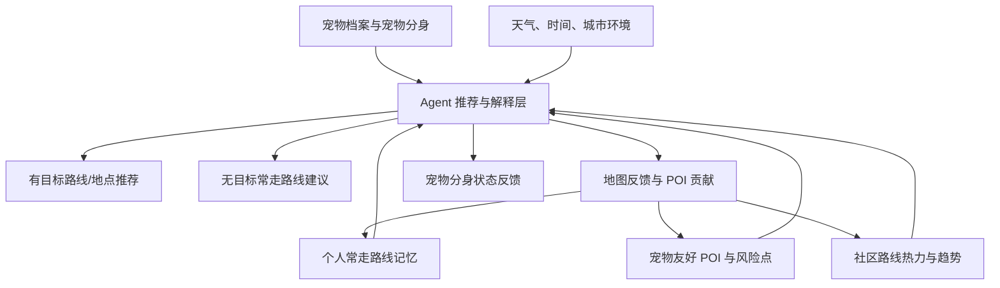

# PRD 修改建议：宠物友好地图、宠物分身 Agent 与社区路线热力

日期：2026-06-13  
目的：基于用户新提出的产品方向，对现有 `docs/prd-pet-mobility-agent.md` 提供修改建议。  
方法：并行调用 3 个子 agent，分别研究产品策略、AI/3D 虚拟宠物技术可行性、路线/热力图/UGC POI 数据与隐私架构；同时参考当前 PRD 与公开资料。

## 0. 总结判断

当前 PRD 的底层判断是对的：不要把产品做成普通“遛狗路线规划器”，而要围绕“这只宠物今天是否适合出门、怎么出门、如何避开风险、哪里真的可用”做决策。

但用户新方向已经让产品形态发生了变化。它不再只是一个带宠出行规划 Agent，而是更像：

> **宠物友好地图 Agent：基于宠物档案、常走路线、社区热力、UGC POI 与宠物分身的个性化出门决策系统。**

一句话版本：

> **这是“懂我家宠物的附近地图”，不是通用地图的宠物皮肤，也不是只规划遛狗路线。**

建议把 PRD 的产品核心从：

```text
带宠出行任务规划器
```

升级为：

```text
宠物附近决策层 = 宠物友好地图 + 个体路线记忆 + 社区热力感知 + Agent 推荐 + 宠物分身反馈
```

最重要的修改不是“加几个功能”，而是重排产品叙事：

- **路线规划降级为功能**：它是输出之一，不是产品本体。
- **宠物友好地图升级为基础设施**：POI、路线、风险点、热力、反馈都在地图上沉淀。
- **常走路线成为核心记忆**：大多数人确实走熟路，所以产品应先判断“今天常走路线是否合适”，再推荐陌生路线。
- **社区热力图成为附近感知层**：不是看别人实时在哪，而是看“这个时间、这类路线、这类宠物的社区趋势”。
- **UGC POI 成为 Agent 的供给来源**：用户上传的地点不是内容流，而是进入推荐系统的结构化数据。
- **虚拟宠物应定义为宠物分身 Agent**：它不是装饰，而是宠物画像、路线偏好、风险反馈、社区贡献激励的可视化身体。

## 1. 当前 PRD 诊断

### 1.1 当前 PRD 的优点

现有 PRD 已经有几个很强的底座，应保留：

1. **反对单纯路线规划**
   - 当前 PRD 明确指出“遛狗不是一条路线”，而是排便、嗅闻、放电、降压、社交或避社交等需求的组合。
   - 这个判断仍然成立。

2. **Dog Need Fulfillment Graph**
   - 当前 PRD 的“狗狗需求完成图谱”很适合承接 POI、路线、风险点、服务节点和用户反馈。
   - 建议保留，但需要扩展成更像“宠物友好地图数据层”。

3. **风险门控**
   - 高温、地表、主干路、电动车、狗群密度等不应被路线排序分数抵消。
   - 这个安全逻辑必须继续保留。

4. **多方案推荐**
   - 当前 PRD 的“附近微出门 / 多方式接驳 / 服务或空间预约”比单一路线强。
   - 但新方向下，需要新增“常走路线判断”和“有目标路线推荐”两套模式。

5. **结构化反馈**
   - 当前 PRD 已经写到用户观察会进入图谱。
   - 新方向下，这应升级为 UGC POI、路线反馈、社区热力和推荐系统的共同数据来源。

### 1.2 当前 PRD 与新方向的冲突

需要修改的地方主要有这些：

| 当前 PRD 表述 | 新方向下的问题 | 修改建议 |
|---|---|---|
| “不是宠物 POI 目录” | 容易把宠物友好地图放得太低，但用户现在明确想做地图 | 改成“不是静态 POI 目录，而是可被 Agent 使用的宠物友好地图” |
| P0 聚焦高风险片区 30-40 分钟遛狗 | 场景过窄，不能覆盖有目标出行、熟悉路线、社区热力 | 改成两个核心模式：有目标推荐、无目标常走路线判断 |
| 社交社区和内容流暂不进入范围 | 这个判断对“泛社区”对，但 UGC POI 和路线反馈必须提前 | 明确“不做泛社区信息流”，但做地图贡献型社区 |
| 长期记忆放到 P1 | 新方向中常走路线是核心，不应太后置 | MVP 至少支持手动保存或识别 2-5 条常走路线 |
| 虚拟宠物缺失 | 用户明确提出 image2/Q版/3D 可互动宠物 | 新增“宠物分身 Agent”章节，但不让它压过地图主链路 |
| 缺少热力图隐私规则 | 社区路线数据风险很高 | 新增路线数据与热力图隐私章节 |

## 2. 建议的新产品定位

### 2.1 推荐定位

建议将 PRD 产品定位改为：

> **Pet Mobility Agent 是一个面向城市养宠人的宠物友好地图 Agent。它通过宠物档案、常走路线、天气环境、社区热力、UGC POI 和宠物分身，帮助主人判断今天该不该出门、走哪条熟悉路线、是否适合探索新地点、路上可能遇到什么，以及哪些宠物友好地点在这一次真实可用。**

### 2.2 不建议的定位

不建议继续强调：

```text
“带宠出行任务规划器”
```

这个表达虽然准确，但偏工具、偏规划、偏单次任务，不能承载社区热力、路线记忆和虚拟宠物。

也不建议写成：

```text
“宠物友好地图”
```

这个表达又太薄，容易变成 POI 列表。

### 2.3 最终建议表达

可以使用：

```text
宠物友好地图 Agent
```

或更产品化一点：

```text
懂你家宠物的附近地图
```

它的差异化是：

- 通用地图知道路怎么走。
- 点评知道店在哪里。
- 宠物社区知道别人怎么说。
- **Pet Mobility Agent 知道这只宠物今天适不适合去、该走哪条熟悉路线、应该避开什么、附近数据是否可信。**

## 3. 建议的新产品架构

建议把 PRD 的功能架构重写成 6 层：



### 3.1 宠物档案与宠物分身层

作用：

- 记录真实宠物约束：体型、年龄、精力、怕热、怕狗、社交偏好、健康限制。
- 生成 Q 版/3D 宠物分身。
- 让宠物分身参与路线解释、风险提醒和反馈引导。

关键原则：

- 宠物分身不是装饰。
- 它必须绑定宠物画像和推荐逻辑。
- 它表达的状态必须来自真实数据，例如天气、路线强度、社区狗密度、历史偏好。

### 3.2 个人常走路线记忆层

作用：

- 记录用户和宠物最常走的路线。
- 识别“晚饭后小区环线”“周末公园路线”“短程排便路线”等 routine。
- 用户每次打开产品时，优先判断这些熟悉路线今天是否适合。

这是新方向中最关键的产品修正，因为用户说得很对：大多数人不会每天探索新路线。

### 3.3 宠物友好 POI 与风险点层

作用：

- 承载宠物友好店、草地、公园、水源、宠物店、医院、禁入点、危险点。
- 每个 POI 不只是地点，而是结构化规则和可信度。

示例字段：

- 是否可进室内。
- 是否仅限户外。
- 是否有体型限制。
- 是否必须牵绳。
- 是否有水碗。
- 是否适合小型犬、老年犬、敏感犬。
- 最近验证时间。
- 上传者和确认者。
- 是否存在争议。

### 3.4 社区路线热力与趋势层

作用：

- 脱敏聚合展示“狗友常走区域”“狗多时段”“安静路线”“热门 POI”“风险点”。
- 让用户自己的常走路线和社区趋势交叉。

重要边界：

- 只能展示趋势和概率。
- 不能展示实时个人位置。
- 不能让用户追踪某个具体主人或宠物。

### 3.5 Agent 推荐与解释层

作用：

- 理解用户有目标或无目标的出门意图。
- 调用宠物档案、天气、常走路线、社区热力、POI 和风险数据。
- 输出推荐、理由、风险、备选方案。

Agent 的职责不是聊天，而是：

```text
理解目标 -> 召回路线/POI -> 过滤风险 -> 排序 -> 解释 -> 收集反馈 -> 更新记忆
```

### 3.6 地图反馈与社区贡献层

作用：

- 用户走完路线后轻量反馈。
- 用户上传 POI、纠错 POI、标记风险点。
- 反馈进入 POI 可信度、路线热力和后续推荐。

建议将社区定义为“地图贡献型社区”，而不是“信息流社区”。

## 4. 两个核心使用模式

PRD 应将核心场景改成两个模式：**有目标**和**无明确目标**。

### 4.1 模式 A：有目标时推荐路线

用户有明确目标：

- 想去宠物友好咖啡店。
- 想找一个能坐下的地方。
- 想顺路买粮或驱虫药。
- 想去宠物医院。
- 想找一个适合放松散步的公园。

用户输入：

```text
今晚想带狗去能坐下的地方，最好顺路买点狗粮，别遇到太多大狗。
```

Agent 输出：

- 推荐 POI。
- 到达路线。
- 路线上的狗密度/风险点。
- POI 宠物友好规则。
- 最近验证时间。
- 是否需要确认。
- 备选路线和备选地点。

建议 PRD 中定义“有目标推荐”的输入：

| 输入 | 示例 |
|---|---|
| 目标类型 | 咖啡店、医院、宠物店、公园、草地、洗护 |
| 宠物约束 | 怕大狗、怕车、怕热、不能走太久 |
| 主人约束 | 时间、预算、是否愿意打车、是否接受人多 |
| 地图上下文 | 当前地点、天气、时间、社区热力、POI 可信度 |

建议输出：

| 输出 | 说明 |
|---|---|
| 首推方案 | 地点 + 路线 + 理由 |
| 备选方案 | 至少 1 个备选 |
| 不推荐项 | 明确不推荐哪些地点/路线以及原因 |
| 宠物友好证据 | 最近验证时间、用户反馈、商家规则 |
| 社区趋势 | 狗多概率、安静程度、热门时段 |
| 执行动作 | 导航、确认、收藏、反馈 |

### 4.2 模式 B：无明确目标时判断常走路线

用户没有明确目标，只是准备出门：

```text
准备带狗出门。
```

系统不应硬推陌生路线，而应先判断常走路线：

- 今天这条熟悉路线是否适合？
- 需不需要缩短？
- 是否应该换时间？
- 是否应该避开某段？
- 是否可以顺路探索一个新 POI？

示例输出：

```text
今天 19:00 不太建议走你常走的“小区东门环线”完整路线：
- 天气闷热，连续暴露段偏长；
- 社区热力显示 18:30-19:30 这段狗密度较高；
- 奶茶最近两次在东门草地遇到大狗后紧张。

更建议：
1. 走“楼下短嗅闻路线”，控制在 12 分钟内；
2. 如果想多走，可以 20:30 后走“河边安静线”；
3. 顺路可以试试新上传的水碗点，但该 POI 仍待验证。
```

这个模式应成为产品留存核心，因为它贴合真实习惯：用户常走熟路，只需要出门前判断。

## 5. 宠物分身 Agent：虚拟宠物形象如何进入 PRD

### 5.1 命名建议

不建议在 PRD 中只写：

```text
虚拟宠物形象生成
```

建议改成：

```text
宠物分身 Agent
```

原因：

- “虚拟形象生成”像一次性玩具。
- “宠物分身 Agent”天然和宠物画像、路线偏好、状态反馈、社区贡献、地图交互有关。

### 5.2 产品角色

宠物分身应承担 4 个角色：

1. **宠物画像的可视化身体**
   - 它不是一个皮肤，而是这只宠物偏好和约束的表达。
   - 例如怕热、怕大狗、喜欢草地、精力高。

2. **出门前决策助手**
   - 根据天气、路线长度、社区狗密度、POI 状态表达“适合 / 不适合 / 建议短走 / 建议晚点”。

3. **路线记忆的情感入口**
   - 用户不一定想看复杂数据，但会接受“今天豆包更适合走短线”。

4. **社区贡献激励**
   - 上传 POI、反馈路线、标记风险点，可以让宠物分身获得徽章、表情、装备或成长记录。
   - 但奖励应服务数据贡献，不应变成无意义游戏化。

### 5.3 技术链路建议

建议 PRD 中写成异步生成管线：

```text
真实宠物照片
-> 宠物主体裁剪/背景去除/特征抽取
-> image-to-image 生成 Q 版 2D 形象
-> 生成多视角 Q 版参考图
-> image/multiview-to-3D 生成低面数模型
-> 自动/半自动 quadruped rig
-> idle / walk / run / sit / sniff 动画
-> GLB/USDZ 进入地图与互动场景
```

公开资料显示：

- [Tripo](https://www.tripo3d.ai/) 支持 text/image/sketch 到 3D，官网也展示了 rigging、animation、texturing 等工作流。
- [TripoSR](https://github.com/VAST-AI-Research/TripoSR) 是 Tripo AI 与 Stability AI 合作的开源单图 3D 重建模型，README 说明可在 A100 上 0.5 秒内生成 3D 模型。
- [Stable Fast 3D](https://stability.ai/news-updates/introducing-stable-fast-3d) 介绍了从单张图片生成 3D asset 的能力，包括 mesh、材质参数与 remeshing。
- [Meshy](https://www.meshy.ai/) 支持 text/image to 3D，并提供游戏、VR/AR、3D printing 等资产使用场景。

### 5.4 难点要写进 PRD

PRD 不应只写“生成 3D 宠物”，还要明确难点：

| 难点 | PRD 边界 |
|---|---|
| Q 版后不像用户真实宠物 | 需要用户确认耳型、毛色、斑纹、尾巴、体型、项圈 |
| 单张照片无法知道背面 | MVP 可 AI 补多视角，V1 鼓励上传 3-5 张照片 |
| 四足 rig 不稳定 | 必须有 2D 降级方案 |
| 移动端地图 + 3D 性能压力 | GLB 控制体积，低端机自动降级 2D |
| 生成成本高 | 设重试次数和月度额度 |
| 宠物照片隐私 | 原图加密、可删除、不默认公开 |

### 5.5 分阶段建议

综合三个子 agent 的意见，我建议不要把 3D 宠物放在 MVP 主链路，但可以放一个轻量“路演/增长版 MVP”。

| 阶段 | 建议范围 | 目的 |
|---|---|---|
| MVP 核心版 | 宠物档案 + Q 版 2D 头像 + 路线推荐反馈 | 验证宠物画像是否提升推荐理解 |
| MVP 展示版 | 2D Q 版候选 + 异步生成静态/轻 idle 3D GLB | 用于路演和传播，不阻塞地图主链路 |
| P1 | 低面数 3D + idle/walk/sit/sniff + 路线状态反馈 | 成为可互动 route companion |
| P2 | 多宠物、多动画、AR check-in、路线回放、装备/徽章 | 作为社区留存和身份系统 |

### 5.6 验收标准建议

PRD 可新增以下验收标准：

- 用户上传 3 张宠物照片后，系统能生成至少 4 个 Q 版候选。
- 用户选择 Q 版后，系统能异步生成一个可预览的 3D 模型。
- 2D 形象生成 P95 小于 60 秒。
- 3D 生成不阻塞地图功能，P95 小于 10 分钟。
- 单个 GLB 目标小于 12MB。
- 至少 80% 内测用户认为 Q 版“像自己的宠物”。
- 路线推荐页至少展示 3 类由真实数据驱动的宠物分身反馈：天气、路线强度、社区狗密度或 POI 状态。
- 删除宠物后，用户原图、生成图、3D 模型不可再访问。

## 6. 常走路线与推荐系统修改建议

### 6.1 新增数据对象

建议在 PRD 中新增数据模型章节：

| 对象 | 说明 |
|---|---|
| `UserProfile` | 居住区域粗粒度、出行偏好、隐私设置、是否参与社区热力图 |
| `PetProfile` | 体型、年龄、品种、精力、怕热/怕冷、怕狗、社交偏好、健康限制 |
| `PetAvatar` | Q 版图、3D 模型、动画、生成状态、版本、删除状态 |
| `RouteSession` | 一次出门记录，含时间、天气、路线 polyline、停留点、距离、反馈 |
| `RoutineRoute` | 系统识别或用户保存的常走路线 |
| `CommunityHeatCell` | 按空间格网和时间段聚合的社区热力单元 |
| `POI` | 宠物友好地点、草地、水源、医院、宠物店、风险点、禁入点 |
| `POIObservation` | 用户上传、签到、纠错、照片、评论、Agent 验证记录 |
| `RecommendationContext` | 一次推荐请求的上下文 |

### 6.2 常走路线识别

MVP 不建议做复杂模型。可以先支持两种方式：

1. 用户手动保存路线。
2. 系统根据 3 次以上相似轨迹建议合并为常走路线。

常走路线应有标签：

- 短程排便线。
- 安静路线。
- 嗅闻路线。
- 社交路线。
- 避狗路线。
- 夜间路线。
- 雨后不推荐路线。
- 高温短走路线。

### 6.3 推荐逻辑

推荐应分为两类：

#### 有目标推荐

```text
召回候选 POI -> 召回候选路线 -> 过滤硬风险 -> 计算适配分 -> 输出推荐和解释
```

#### 无目标推荐

```text
读取常走路线 -> 结合天气/时间/社区热力/宠物状态 -> 判断今天是否适合 -> 推荐熟悉路线或替代路线
```

建议使用可解释分数，而不是黑盒模型：

```text
推荐分 =
目标匹配
+ 宠物适配
+ 天气安全
+ 路线熟悉度
+ POI 可信度
+ 社交匹配
- 风险惩罚
- 绕路成本
```

但安全风险仍然要 hard veto，不能被高分抵消。

### 6.4 推荐解释模板

PRD 应要求每次推荐都输出解释：

- 为什么推荐。
- 为什么不推荐其他常走路线。
- 社区数据如何影响推荐。
- POI 可信度如何。
- 如果用户坚持原路线，应该怎么降级。

示例：

```text
推荐走“河边短线”，不推荐“东门环线”：
- 今天 19:00 东门环线狗密度偏高；
- 奶茶档案显示怕大狗；
- 河边短线距离更短，阴影更多；
- 但河边水碗点仍待验证，建议带水。
```

## 7. 社区热力图与隐私

### 7.1 热力图应该展示什么

社区热力图不是“别人在哪里”，而是“附近趋势”。

建议展示：

- 狗友常走路线热度。
- 不同时段狗多概率。
- 安静路线。
- 社交路线。
- 热门宠物友好 POI。
- 风险点热度，例如禁入、施工、流浪狗、电动车压力。
- 小型犬/大型犬/敏感犬更常选择的路线趋势。

### 7.2 热力图不应该展示什么

必须明确禁止：

- 展示单个用户实时位置。
- 展示单条原始路线。
- 展示可推断家庭地址的起终点。
- 展示某只具体宠物的行动轨迹。
- 让用户追踪“某个狗友现在在哪”。

### 7.3 隐私策略

PRD 应新增以下规则：

| 策略 | 说明 |
|---|---|
| 默认 opt-in | 用户明确同意后才贡献社区热力 |
| 原始 GPS 私有 | 原始轨迹只用于个人回放和个人推荐 |
| 聚合格网 | 社区侧只保留 H3/geohash 等格网聚合 |
| 起终点遮罩 | 家、公司、小区门口附近做隐私半径 |
| 延迟展示 | 至少延迟 30-60 分钟进入社区热力 |
| k 匿名阈值 | 至少达到 10 个不同用户或足够 session 才展示 |
| 粗时间粒度 | 使用“工作日晚上”“周末上午”等，不精确到分钟 |
| 低密度隐藏 | 低密度区域不展示或加噪声 |
| 用户控制 | 可暂停贡献、删除历史、退出热力图 |

### 7.4 需要引用的风险案例

PRD 可以在风险章节引用 Strava 的教训。公开资料显示，Strava Global Heatmap 曾因聚合运动路线暴露敏感地点而引发隐私争议。这个案例说明：即便是“热力图”，如果处理不当，也可能暴露习惯路线和敏感位置。

同时，[Strava Metro](https://metro.strava.com/) 的官方页面说明其将社区运动数据做聚合、去识别化和上下文化，用于帮助城市与步道规划。这是更接近本产品可借鉴的方向：**把个人轨迹变成公共趋势，而不是把个人暴露给社区。**

## 8. UGC POI 与 Agent 推荐系统

### 8.1 POI 类型

建议 PRD 明确支持以下 POI：

| 类型 | 示例 |
|---|---|
| 宠物友好餐饮 | 咖啡店、餐厅、露台 |
| 活动空间 | 草地、公园、广场、河边步道 |
| 补给 | 水碗、宠物店、宠物用品柜 |
| 医疗 | 宠物医院、夜间急诊 |
| 服务 | 洗护、训练、寄养 |
| 风险 | 禁入点、狗多点、施工、电动车高压段、流浪狗点 |
| 交通辅助 | 安全上车点、停车点、入口、电梯 |

### 8.2 POI 状态

建议每个 POI 有状态：

- 待验证。
- 已验证。
- 有争议。
- 已过期。
- 已隐藏。

### 8.3 POI 可信度

POI 可信度应由多因素决定：

```text
POI 可信度 =
上传者信誉
+ 多人确认
+ 最近验证时间
+ 照片/签到/商家证据
+ Agent 外部核验
- 纠错次数
- 信息过期
- 争议记录
```

### 8.4 POI 进入 Agent 推荐

PRD 应写清楚：

- 用户上传 POI 后，不应立即高权重进入所有推荐。
- 待验证 POI 可以作为“可探索点”或“低置信候选”。
- 多人确认或商家认领后，才可进入高置信推荐。
- 高风险 POI，例如医院、禁入、危险点，不能只靠单个用户上传。

### 8.5 POI 上传流程

建议流程：

```text
用户长按地图 / 拍照上传
-> 选择 POI 类型
-> 填写宠物友好规则或风险描述
-> 上传证据
-> 进入待验证状态
-> 附近用户确认或纠错
-> Agent 定期复核
-> 进入推荐系统
```

## 9. MVP/P1/P2 调整建议

### 9.1 MVP 核心目标

MVP 应验证：

> 用户是否愿意在出门前打开产品，让它基于宠物档案、常走路线、天气和 POI 判断“现在走哪条更合适”。

不是验证：

> 能否生成最完整路线、最炫 3D 宠物、最大社区。

### 9.2 MVP 建议范围

| 模块 | MVP 范围 |
|---|---|
| 宠物档案 | 体型、年龄、精力、怕热、怕狗、怕车、可走时长 |
| 宠物分身 | Q 版 2D 头像；展示版可异步生成静态 3D |
| 常走路线 | 手动保存或自动识别 2-5 条 |
| 出门 Agent | 有目标推荐 + 无目标常走路线判断 |
| 宠物友好地图 | 基础 POI、风险点、水源、草地、公园、医院、宠物店 |
| UGC POI | 上传、纠错、待验证、最近验证时间 |
| 反馈 | 走完后 1-2 个问题：狗多吗、是否顺利、是否有风险 |
| 热力图 | 可用模拟/小范围 pilot 数据展示趋势，不做实时社区 |
| 隐私 | 路线记录开关、社区贡献 opt-in、起终点隐藏 |

### 9.3 MVP 不建议做

- 复杂社交信息流。
- 排行榜和竞技化路线挑战。
- 实时看到其他狗的位置。
- 真实商家端后台。
- 真实交易和预约履约。
- 完整 AR 宠物互动。
- 医疗诊断。
- 全国地图铺开。

### 9.4 P1 建议范围

| 模块 | P1 范围 |
|---|---|
| 社区热力图 | 基于 opt-in 的脱敏聚合热力 |
| 个人路线交叉分析 | 常走路线与社区狗密度、安静程度、风险点交叉 |
| POI 可信度体系 | 多人确认、过期降权、争议标记 |
| 宠物分身 | 低面数 3D、idle/walk/sit/sniff、地图状态反馈 |
| 主动提醒 | 高温、降雨、空气质量、狗多时段、常走路线异常 |
| 弱社交 | 同路线狗友、附近搭子，但不暴露实时位置 |

### 9.5 P2 建议范围

| 模块 | P2 范围 |
|---|---|
| 商家端 | POI 认领、宠物友好认证、活动发布 |
| 服务交易 | 洗护、寄养、训练、宠物友好车 |
| 可穿戴/硬件 | 智能项圈、GPS、健康数据 |
| 高级宠物分身 | 多宠物、AR check-in、路线回放、装备/徽章 |
| 社区治理 | 地图贡献者等级、审核队列、区域志愿者 |
| 多 Agent | 地图 Agent、隐私 Agent、推荐 Agent、商家核验 Agent |

## 10. PRD 章节级修改清单

### 10.1 产品定位

建议重写。

原方向：

```text
带宠出行决策系统 / 任务规划器
```

建议改为：

```text
宠物友好地图 Agent：基于宠物档案、常走路线、社区热力、UGC POI 和宠物分身的个性化出门决策系统。
```

### 10.2 背景与问题

建议新增问题：

- 用户常走熟悉路线，但不知道今天哪条更适合。
- 宠物友好信息模糊、过期、不可验证。
- 社区里有大量“附近经验”，但没有结构化沉淀到地图。
- 用户愿意贡献路线/POI，但担心隐私。
- 宠物地图缺乏情感入口，难以形成留存和贡献动机。

### 10.3 目标用户

建议新增或强化：

- 城市日常遛狗人。
- 怕狗/敏感犬主人。
- 老年犬/幼犬主人。
- 新搬家宠物家庭。
- 喜欢探索宠物友好地点的用户。
- 愿意贡献地图数据的核心狗友。

### 10.4 核心使用场景

建议从当前三个高风险场景改为五个：

| 场景 | 说明 |
|---|---|
| 无目标日常出门 | 判断今天走哪条常走路线 |
| 有目标附近出行 | 去宠物友好 POI、医院、宠物店、公园 |
| 高风险天气出门 | 高温、降雨、空气质量、地面风险 |
| 社区路线感知 | 判断某时段狗多不多、是否适合社交/避狗 |
| 地图贡献 | 上传 POI、纠错、反馈路线 |

### 10.5 功能优先级

建议重写 P0/P1/P2，突出：

- P0：常走路线 + 出门 Agent + 基础 POI + 轻量反馈。
- P1：社区热力 + POI 可信度 + 3D 宠物分身互动。
- P2：商家端、服务交易、可穿戴、AR、复杂社区。

### 10.6 核心用户流程

建议新增两条流程：

1. **无目标出门流程**

```text
打开 App -> 选择宠物 -> 读取常走路线和天气 -> Agent 判断今天推荐哪条 -> 用户开始记录 -> 出行后反馈 -> 更新路线记忆和社区趋势
```

2. **有目标推荐流程**

```text
输入目标 -> 召回 POI -> 结合宠物档案、社区热力、天气、路线风险排序 -> 输出方案 -> 用户选择 -> 到达/反馈 -> 更新 POI 可信度
```

### 10.7 Agent 架构

当前“单一 Orchestrator + 模块”仍可保留，但模块要改：

```text
Orchestrator Agent
-> 意图解析
-> 宠物画像与宠物分身状态
-> 常走路线记忆
-> POI/UGC 可信度检索
-> 社区热力检索
-> 天气与风险评估
-> 推荐排序与解释
-> 反馈写入
-> 隐私策略检查
```

### 10.8 数据模型

建议新增独立章节，覆盖：

- `PetProfile`
- `PetAvatar`
- `RouteSession`
- `RoutineRoute`
- `CommunityHeatCell`
- `POI`
- `POIObservation`
- `RecommendationContext`

### 10.9 隐私与安全

建议新增独立章节，覆盖：

- 路线记录开关。
- 社区贡献 opt-in。
- 原始轨迹与聚合热力分离。
- 起终点遮罩。
- k 匿名阈值。
- 延迟展示。
- 删除权。
- 不显示实时宠物/主人位置。
- 高风险推荐免责声明。

### 10.10 宠物分身 Agent

建议新增独立章节，覆盖：

- 2D Q 版生成。
- 3D 生成。
- 生成任务状态。
- 失败降级。
- 地图互动状态。
- 性能限制。
- 隐私和删除。
- 与推荐系统的关系。

### 10.11 成功指标

建议从“生成方案数量”转为：

| 指标 | 说明 |
|---|---|
| 出门建议采纳率 | 用户是否真的按推荐出门 |
| 7 日/30 日重复使用率 | 是否形成出门前打开习惯 |
| 常走路线保存率 | 用户是否愿意让产品记住路线 |
| 常走路线识别准确率 | 用户是否认可系统识别的 routine |
| 推荐解释满意度 | 用户是否理解为什么推荐 |
| POI 贡献率 | 每 100 个活跃用户贡献多少有效 POI |
| POI 验证率 | UGC 信息被确认的比例 |
| POI 纠错率 | 信息过期或错误比例 |
| 路线反馈率 | 出行后是否愿意反馈 |
| 热力图 opt-in 率 | 用户是否信任社区贡献 |
| 风险提醒命中率 | 天气/狗多/禁入/施工提醒是否有用 |
| 宠物分身生成完成率 | 用户是否完成 Q 版/3D 生成 |
| 宠物分身使用影响 | 是否提升反馈率、留存、贡献率 |

## 11. 需要保留的边界

即使新方向更丰富，也建议保留几个边界：

1. **不做泛社区信息流**
   - 社区围绕地图贡献、路线反馈、POI 可信度、附近事件组织。

2. **不做实时找狗友**
   - 可以做趋势、概率、弱连接，但不暴露实时位置。

3. **不把虚拟宠物变成主线游戏**
   - 可以有成长、徽章、装备，但要服务路线反馈和社区贡献。

4. **不做医疗诊断**
   - 宠物医院和风险提醒可以有，但不能替代兽医判断。

5. **不承诺 POI 永远准确**
   - 必须展示最近验证时间、置信度和争议。

6. **不全国铺开**
   - 先做一个宠物密度高的区域，验证路线记录、POI 贡献和热力图。

## 12. 建议的 PRD 改写顺序

如果下一步正式改 PRD，建议按这个顺序：

1. 重写产品定位。
2. 重写核心场景：有目标 / 无目标。
3. 重写功能优先级 P0/P1/P2。
4. 新增数据模型章节。
5. 新增社区热力与隐私章节。
6. 新增 UGC POI 机制章节。
7. 新增宠物分身 Agent 章节。
8. 修改 Agent 架构。
9. 修改核心用户流程。
10. 修改成功指标与暂不进入范围。

## 13. 建议保留的 PRD 核心句

可以保留并升级现有 PRD 的核心判断：

> 高德和百度解决人和车怎么走；Pet Mobility Agent 解决这只宠物今天适不适合出门、该走哪条熟悉路线、附近哪些宠物友好信息可信，以及路上可能遇到什么。

更产品化的版本：

> **普通地图给路线，Pet Mobility Agent 给适合这只宠物的附近判断。**

## 14. 最终建议

我建议 PRD 的主线这样改：

```text
宠物友好地图 Agent
├─ 宠物档案与宠物分身
├─ 常走路线记忆
├─ 有目标推荐
├─ 无目标出门建议
├─ UGC 宠物友好 POI
├─ 社区路线热力
├─ Agent 推荐解释
└─ 隐私与可信度机制
```

其中 MVP 应聚焦：

```text
宠物档案 + 常走路线 + 出门 Agent + 基础 UGC POI + 轻量反馈 + Q 版宠物分身
```

P1 再补：

```text
真实社区热力 + POI 可信度 + 3D 宠物分身互动 + 主动提醒
```

P2 再考虑：

```text
商家端、服务交易、可穿戴、AR、复杂社区和多 Agent
```

最核心的一句话：

> **不要把“地图、路线、社区、3D 宠物”写成四个并列功能；要把它们组织成一个闭环：宠物分身承载宠物画像，地图承载附近信息，路线记录承载个人习惯，社区热力承载群体趋势，Agent 把这些合成为“这次出门怎么更适合我家宠物”的建议。**

## 15. 参考链接

- [Tripo](https://www.tripo3d.ai/)
- [TripoSR GitHub](https://github.com/VAST-AI-Research/TripoSR)
- [Stable Fast 3D](https://stability.ai/news-updates/introducing-stable-fast-3d)
- [Meshy](https://www.meshy.ai/)
- [Strava Metro](https://metro.strava.com/)
- [Waze crowdsourced navigation overview](https://en.wikipedia.org/wiki/Waze)
- [AllTrails](https://www.alltrails.com/)
- [Strava heatmap privacy discussion](https://en.wikipedia.org/wiki/Strava)
